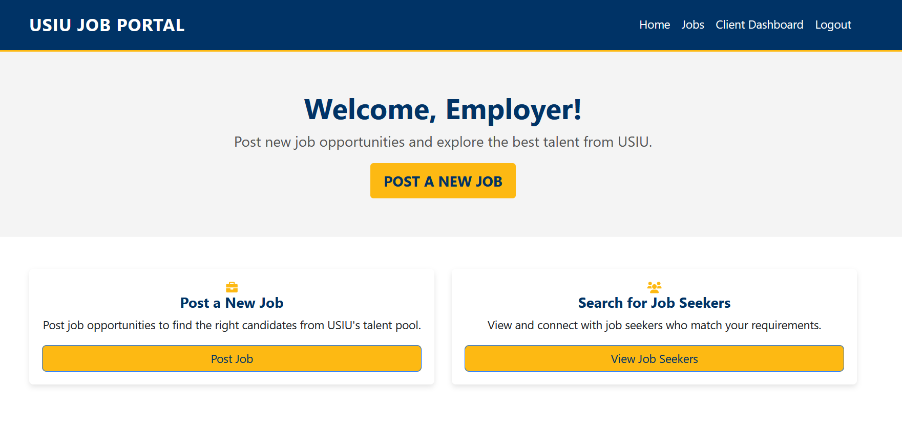

# Job Board Portal

## Overview
The Job Board Portal is a web application designed to help job seekers and employers connect. It was developed as part of the APP 4080 course at United States International University - Africa (USIU-A) and tailored to the Kenyan job market. The portal provides features such as job listings, user dashboards, and profile management, offering a streamlined experience for employees and clients (employers).

## Features
- **Employee Login**: Access job listings, create profiles, and upload resumes.
- **Client Login**: Manage job postings and view employee profiles.
- **Landing Page**: Displays job opportunities available in the database.
- **Employee Dashboard**: Tools to apply for jobs and update user profiles.
- **Client Dashboard**: Manage job postings and employee interactions.
- **Search Functionality**: Look for jobs by category, location, or company.
- **Email Notifications**: Employees receive job alerts based on their profile.

## Technology Stack
- **Backend**: Java, Spring Boot
- **Frontend**: Thymeleaf, Bootstrap
- **Database**: MySQL Workbench

## Setup Instructions
To run this project locally:
1. Clone the repository:
   ```bash
   git clone https://github.com/lizardcat/usiu-job-board.git
   ```
2. Open the project in **IntelliJ IDEA**.
3. Run the main application class `JobBoardApplication`.
4. **Note**: The repository does not include a populated database. You must set up a MySQL database and populate it with appropriate job and user data.
   - Create a MySQL database matching the structure in `application.properties`.
   - Populate the database with your own sample data.

## Screenshots
Below are key pages of the Job Board Portal:
1. **Login Page**: Displays login options for employees and clients.


3. **Landing Page**: Lists available jobs.


4. **Job Seeker Dashboard**: Shows job listings, profile management, and resume upload functionality.

5. **Client Dashboard**: Allows clients to create and manage job postings.



## Future Plans
- Develop a mobile version of the portal for increased accessibility.
- Integrate machine learning to recommend jobs based on user profiles.
- Add analytics for clients to view job post performance and applicant trends.
- Implement advanced security features for enhanced user protection.

## License
This project is for educational purposes and is not intended for commercial use.

